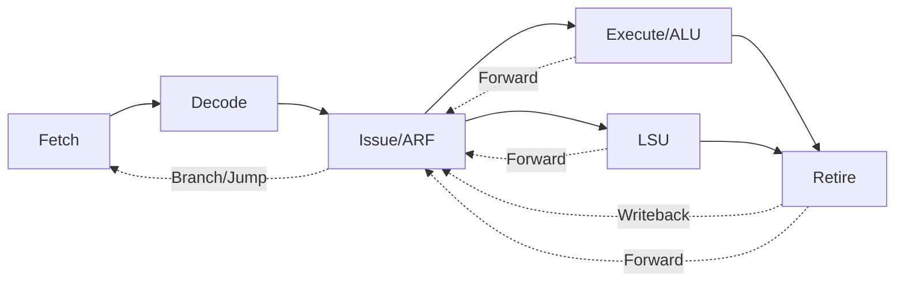

<div align="center">
  <h1>DHRUT-V</h1>
  
</div>

---

A fully pipelined, in-order superscalar(not yet) **RISC-V** core written in **SystemVerilog**.

Designed for learning, verification, FPGA/ASIC exploration, and as a foundation for future CPU projects.

> **"It will run DOOM one day!"**

---

## Micro-architecture

DHRUT-V utilizes a modern 5-stage pipeline decoupled by SystemVerilog interfaces.



### Pipeline Breakdown

1.  **Fetch (IF)**: Fetches 32-bit instructions from instruction memory using a simple request/acknowledge interface. Supports PC redirection for branches and jumps.
2.  **Decode (ID)**: Decodes instructions into a rich micro-op (`uop_t`) structure. Identifies source/destination registers and immediate values.
3.  **Issue (IS)**: The heart of the core.
    - contains the **Architectural Register File (ARF)**.
    - Performs **Scoreboarding** and hazard detection(feature yet to be implemented).
    - Handles **Operand Forwarding** from ALU, LSU, and Retire stages.
    - Resolves **Branches and Jumps** early to reduce bubbles.
    - Dispatches uops to functional units.
4.  **Functional Units**:
    - **ALU**: Performs arithmetic, logic, and comparison operations.
    - **LSU**: Handles Load and Store operations with sign-extension and byte/half-word/word alignment.
5.  **Retire (RE)**: Finalizes instruction execution, collects results, and triggers the write-back to the ARF in the Issue stage.

---

## Getting Started

### Prerequisites

Ensure you have the following installed (or use the provided install script):

- **Verilator**: For high-performance RTL simulation and linting.
- **RISC-V GNU Toolchain**: `riscv-none-elf-gcc` (xPack distribution recommended).
- **Spike**: The official RISC-V ISA simulator (used as a Golden Reference Model).
- **Python 3.10+**: With `cocotb`, `pyuvm`, and `PyYAML`.

### One-Click Setup

Setup script for Ubuntu/Debian systems:

```bash
# Clone the repo
git clone https://github.com/SudeepSnd/DHRUT-V.git
cd DHRUT-V

# Run the installer (installs toolchain, spike, verilator, and venv)
./tools/install.sh

# Reload shell to update PATH
source ~/.bashrc
```

### Activate Environment

```bash
source ~/riscv_pyenv/bin/activate
```

---

## Running Simulations

DHRUT-V uses a Python-based verification environment powered by [cocotb](https://www.cocotb.org/) and [pyUVM](https://github.com/pyuvm/pyuvm).

### Run a Specific Assembly Test

Tests are located in `tests/asm/`. To run a test (e.g., `add.S`):

```bash
./tools/simulate.sh add
```

This will:
1. Compile the assembly into an ELF/HEX.
2. Launch Verilator with the `pyUVM` testbench.
3. Compare the RTL execution against a model or expected results.

### RTL Linting

Always keep the RTL clean!

```bash
./tools/lint.sh
```

---

## Project Structure

```text
DHRUT-V/
├── rtl/                    # SystemVerilog RTL
│   ├── include/            # Packages and shared definitions
│   ├── interfaces/         # SV Interfaces for pipeline connectivity
│   ├── pipeline/           # Core pipeline stages (ifetch, decode, issue, etc.)
│   └── tb_top.sv           # Top-level module for simulation
├── test_bench/             # Verification Environment
│   ├── tb_pyuvm/           # pyUVM Agents, Scoreboard, and Environments
│   └── run_test.py         # cocotb entry point
├── tests/                  # Test Suites
│   ├── asm/                # Assembly source files (.S)
│   ├── linker.ld           # Linker script for bare-metal
│   └── build/              # Generated HEX/ELF/DIS artifacts
├── tools/                  # Tooling & Scripts
│   ├── install.sh          # Full environment setup
│   ├── lint.sh             # Verilator linting script
│   ├── simulate.sh         # Simulation entry point
│   └── riscof/             # RISCOF configuration and plugins
└── README.md
```

---

## Roadmap

- [x] Full RV32I Base ISA Support.
- [x] Early Branch/Jump resolution.
- [x] Basic pyUVM Verification Infrastructure.
- [x] Full compliance with RV32I_m RISCOF tests.
- [ ] **CSR Support (Zicsr)**: Machine-mode CSRs and official compliance.
- [ ] **Benchmarking and Performance Enhancements**.
- [ ] **FPGA Deployment**: Booting bare-metal code on a Xilinx/Lattice FPGA.
- [ ] **DOOM**: Porting a bare-metal Doom engine.

---

## Creator

**Sudeep Joshi**  
[LinkedIn Profile](https://www.linkedin.com/in/sudeep-joshi-569951207/)

---

## License

This project is licensed under the MIT License - see the [LICENSE](LICENSE) file for details.
