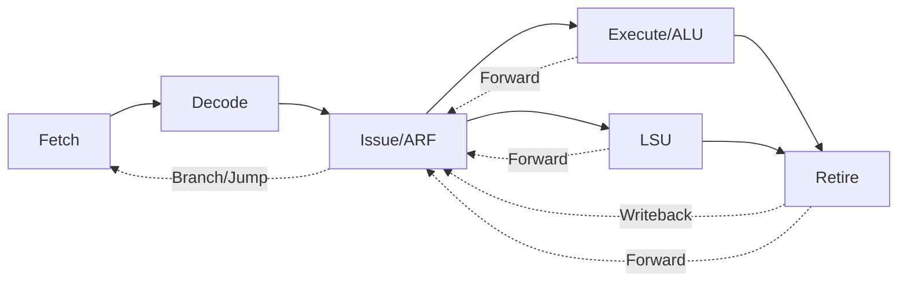

# DHRUT-V 🚀

A fully pipelined, in-order superscalar **RV32I RISC-V** core written in **SystemVerilog**.

Designed for learning, verification, FPGA/ASIC exploration, and as a foundation for further extensions.

> **"It will run DOOM one day!"** — *The DHRUT-V Manifesto*

---

## ⚡ Features

- **5-Stage Pipeline**: Optimized Fetch → Decode → Issue → Execute → Retire flow.
- **ISA Support**: Full **RV32I** (Base Integer) implementation.
- **In-Order Superscalar Foundation**: Designed to support dual-issue in the future (currently single-issue dispatch).
- **Hazard Resolution**: Robust operand forwarding (ALU, LSU, Retire) and stall propagation.
- **Early Branch Resolution**: Branch/Jump decisions resolved in the **Issue** stage to minimize misprediction penalty.
- **Load-Store Unit (LSU)**: Dedicated unit with back-pressure handling and synchronous memory interface.
- **Verification-First**: Integrated **pyUVM** and **cocotb** testbench for high-confidence RTL verification.
- **Compliance Ready**: Integrated with **RISCOF** for architectural compliance testing.

---

## 🏗️ Architecture

DHRUT-V utilizes a modern 5-stage pipeline decoupled by SystemVerilog interfaces.



### Pipeline Breakdown

1.  **Fetch (IF)**: Fetches 32-bit instructions from instruction memory using a simple request/acknowledge interface. Supports PC redirection for branches and jumps.
2.  **Decode (ID)**: Decodes instructions into a rich micro-op (`uop_t`) structure. Identifies source/destination registers and immediate values.
3.  **Issue (IS)**: The heart of the core.
    - contains the **Architectural Register File (ARF)**.
    - Performs **Scoreboarding** and hazard detection.
    - Handles **Operand Forwarding** from ALU, LSU, and Retire stages.
    - Resolves **Branches and Jumps** early to reduce bubbles.
    - Dispatches uops to functional units (ALU or LSU).
4.  **Execute (EX/LSU)**:
    - **ALU**: Performs arithmetic, logic, and comparison operations.
    - **LSU**: Handles Load and Store operations with sign-extension and byte/half-word/word alignment.
5.  **Retire (RE)**: Finalizes instruction execution, collects results, and triggers the write-back to the ARF in the Issue stage.

---

## 🚀 Getting Started

### 📦 Prerequisites

Ensure you have the following installed (or use the provided install script):

- **Verilator**: For high-performance RTL simulation and linting.
- **RISC-V GNU Toolchain**: `riscv64-unknown-elf-gcc` (configured for rv32i).
- **Spike**: The official RISC-V ISA simulator (used as a Golden Reference Model).
- **Python 3.10+**: With `cocotb`, `pyuvm`, and `PyYAML`.

### 🛠️ One-Click Setup

We provide a comprehensive setup script for Ubuntu/Debian systems:

```bash
# Clone the repo
git clone https://github.com/SudeepSnd/DHRUT-V.git
cd DHRUT-V

# Run the installer (installs toolchain, spike, verilator, and venv)
./tools/install.sh

# Reload shell to update PATH
source ~/.bashrc
```

### 🐍 Activate Environment

```bash
source ~/riscv_pyenv/bin/activate
```

---

## 🧪 Running Simulations

DHRUT-V uses a Python-based verification environment powered by **cocotb** and **pyUVM**.

### Run a Specific Assembly Test

Tests are located in `tests/asm/`. To run a test (e.g., `add.S`):

```bash
./tools/simulate.sh add
```

This will:
1. Compile the assembly into an ELF/HEX.
2. Launch Verilator with the `pyUVM` testbench.
3. Compare the RTL execution against a model or expected results.

### RTL Linting

Always keep the RTL clean!

```bash
./tools/lint.sh
```

---

## 📂 Project Structure

```text
DHRUT-V/
├── rtl/                    # 🛠️ SystemVerilog RTL
│   ├── include/            # Packages and shared definitions
│   ├── interfaces/         # SV Interfaces for pipeline connectivity
│   ├── pipeline/           # Core pipeline stages (ifetch, decode, issue, etc.)
│   └── tb_top.sv           # Top-level module for simulation
├── test_bench/             # 🐍 Verification Environment
│   ├── tb_pyuvm/           # pyUVM Agents, Scoreboard, and Environments
│   └── run_test.py         # cocotb entry point
├── tests/                  # 📝 Test Suites
│   ├── asm/                # Assembly source files (.S)
│   ├── linker.ld           # Linker script for bare-metal
│   └── build/              # Generated HEX/ELF/DIS artifacts
├── tools/                  # 🔧 Tooling & Scripts
│   ├── install.sh          # Full environment setup
│   ├── lint.sh             # Verilator linting script
│   ├── simulate.sh         # Simulation entry point
│   └── riscof/             # RISCOF configuration and plugins
└── README.md
```

---

## 🗺️ Roadmap

- [x] Full RV32I Base ISA Support.
- [x] Early Branch/Jump resolution.
- [x] Basic pyUVM Verification Infrastructure.
- [ ] **M-Extension**: Integer Multiplication and Division.
- [ ] **CSR Support**: Machine-mode CSRs and Interrupts.
- [ ] **Zicsr Compliance**: Pass official RISC-V architectural tests.
- [ ] **Dual-Issue**: Transition to a true superscalar dispatch.
- [ ] **FPGA Deployment**: Booting bare-metal code on a Xilinx/Lattice FPGA.
- [ ] **DOOM**: Porting a bare-metal Doom engine.

---

## 🤝 Contributing

Contributions are welcome! Whether it's fixing a bug in the LSU, optimizing the decoder, or adding new tests, feel free to open a PR. 

1. Fork the repository.
2. Create your feature branch.
3. Run `tools/lint.sh` and ensure all tests pass.
4. Submit a Pull Request.

---

## 📄 License

This project is licensed under the MIT License - see the [LICENSE](LICENSE) file for details.
