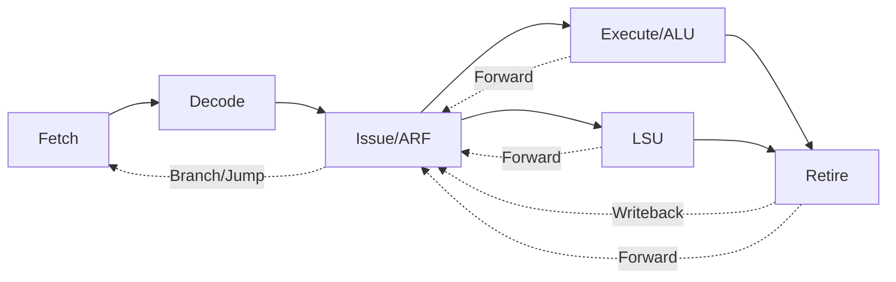

<div align="center">
  <h1>DHRUT-V</h1>
  
</div>

---

A fully pipelined, in-order superscalar(not yet) **RISC-V** core written in **SystemVerilog**.

Designed for learning, verification, FPGA/ASIC exploration, and as a foundation for future CPU projects.

> **"It will run DOOM one day!"**

---

## Micro-architecture

DHRUT-V utilizes a modern 5-stage pipeline decoupled by SystemVerilog interfaces.


```mermaid
graph LR
    IF[Fetch] --> ID[Decode]
    ID --> IS[Issue/ARF]
    IS --> EX[Execute/ALU]
    IS --> LSU[LSU]
    EX --> RE[Retire]
    LSU --> RE
    RE -.->|Writeback| IS
    RE -.->|Forward| IS
    EX -.->|Forward| IS
    LSU -.->|Forward| IS
    IS -.->|Branch/Jump| IF
```

### Pipeline Breakdown

1.  **Fetch (IF)**: Fetches 32-bit instructions from instruction memory using a simple request/acknowledge interface. Supports PC redirection for branches and jumps.
2.  **Decode (ID)**: Decodes instructions into a rich micro-op (`uop_t`) structure. Identifies source/destination registers and immediate values.
3.  **Issue (IS)**: The heart of the core.
    - contains the **Architectural Register File (ARF)**.
    - Performs **Scoreboarding** and hazard detection(feature yet to be implemented).
    - Handles **Operand Forwarding** from ALU, LSU, and Retire stages.
    - Resolves **Branches and Jumps** early to reduce bubbles.
    - Resolves **CSR reads/writes and traps** (`ecall`/`ebreak`/illegal-instruction/`mret`) the same cycle, via an embedded M-mode CSR/trap unit (`rtl/pipeline/csr.sv`) — see [CSR / Trap Support](#csr--trap-support-zicsr-m-mode) below.
    - Dispatches uops to functional units.
4.  **Functional Units**:
    - **ALU**: Performs arithmetic, logic, and comparison operations.
    - **LSU**: Handles Load and Store operations with sign-extension and byte/half-word/word alignment.
5.  **Retire (RE)**: Finalizes instruction execution, collects results, and triggers the write-back to the ARF in the Issue stage.

---

## Getting Started

### Prerequisites

Ensure you have the following installed (or use the provided install script):

- **Verilator**: For high-performance RTL simulation and linting.
- **RISC-V GNU Toolchain**: `riscv-none-elf-gcc` (xPack distribution recommended).
- **Spike**: The official RISC-V ISA simulator (used as a Golden Reference Model).
- **Python 3.10+**: With `cocotb`, `pyuvm`, and `PyYAML`.

### One-Click Setup

Setup script for Ubuntu/Debian systems:

```bash
# Clone the repo
git clone https://github.com/SudeepSnd/DHRUT-V.git
cd DHRUT-V

# Run the installer (installs toolchain, spike, verilator, and venv)
./tools/install.sh

# Reload shell to update PATH
source ~/.bashrc
```

### Activate Environment

```bash
source venv/bin/activate
```

---

## Running Simulations

DHRUT-V uses a Python-based verification environment powered by [cocotb](https://www.cocotb.org/) and [pyUVM](https://github.com/pyuvm/pyuvm).

### Run a Specific Assembly Test

Tests are located in `tests/asm/`. To run a test (e.g., `add.S`):

```bash
./tools/simulate.sh add
```

This will:
1. Compile the assembly into an ELF/HEX.
2. Launch Verilator with the `pyUVM` testbench.
3. Compare the RTL execution against a model or expected results.

### RTL Linting

Always keep the RTL clean!

```bash
./tools/lint.sh
```

---

## CSR / Trap Support (Zicsr, M-mode)

DHRUT-V implements a minimal **M-mode-only** CSR and trap unit (RV32I + Zicsr — no S/U-mode, no PMP, no vectored/delegated interrupts): `CSRRW/S/C` (+ immediate forms), `ECALL`, `EBREAK`, `MRET`, and illegal-instruction detection, resolved combinationally in the Issue stage at the same point branches/jumps already are.

**Implemented CSRs**: `mstatus` (MIE/MPIE/MPP), `misa`, `mie`, `mtvec` (direct mode only), `mscratch`, `mepc`, `mcause`, `mtval`, `mip` (hardwired 0 — no CLINT/PLIC yet), `mcycle(h)`, `minstret(h)`, and the read-only ID registers.

**Verification status**: 5 directed, self-checking assembly tests (`tests/asm/csr_basic.S`, `trap_ecall.S`, `trap_illegal.S`, `trap_ebreak.S`, `trap_mret.S`) pass against Spike + the cocotb/pyUVM testbench. The riscof RV32I compliance regression has **not** been extended to cover Zicsr/privilege yet (`tools/riscof/dhrutv/dhrutv_isa.yaml` still declares plain `RV32I`) — that's the remaining gate before this is considered fully compliance-verified.

### SystemRDL spec (`rtl/csr/`) — validation pass, not (yet) the source of truth

As a cross-check, the hand-written CSR register file (`rtl/pipeline/csr.sv`) has been reverse-engineered into a [SystemRDL](https://www.accellera.org/downloads/standards/systemrdl) spec, and RTL + documentation were regenerated from it via [PeakRDL](https://peakrdl.readthedocs.io):

```text
rtl/csr/
├── csr_regfile.rdl     # SystemRDL description of every register/field, with
│                        # explicit notes on non-obvious access behavior (hw vs
│                        # sw write priority, mcycle/minstret write-vs-increment
│                        # races, etc.) reverse-engineered from the RTL
├── generated/           # `peakrdl regblock csr_regfile.rdl -o generated --cpuif passthrough`
└── html_ref/             # `peakrdl html csr_regfile.rdl -o html_ref` — open html_ref/index.html
```

**Important — how this fits into the build today:** RTL generation from the `.rdl` is a **separate, manual step**, not part of `simulate.sh`/`lint.sh`/any automated build. The CPU is still built entirely from the hand-written `rtl/pipeline/csr.sv`; nothing in `rtl/csr/generated/` is referenced by `tb_top.sv` or any other pipeline file. The `.rdl` and its generated output exist purely to validate the hand-written module by comparison, and two open questions need resolving before the generated block could realistically replace it:

1. RISC-V CSR numbers (e.g. `0x300`, `0x341`) aren't 4-byte-aligned byte offsets, so the `.rdl` uses plain sequential offsets internally — a CSR-number → offset translation table would need to be added to `issue.sv`'s integration glue if the generated block ever replaced the hand-written one.
2. PeakRDL's generated hardware-write priority for `hw=rw` fields defaults to *software-over-hardware* on a same-cycle collision, the opposite of the hand-written RTL's *trap-always-wins* priority. This is currently unobservable (Issue resolves one instruction per cycle, so a CSR write and a trap can never coincide) but would matter the moment superscalar issue exists.

If/when this is promoted from "validation pass" to "generator of the real CSR block," update this section.

---

## Project Structure

```text
DHRUT-V/
├── rtl/                    # SystemVerilog RTL
│   ├── include/            # Packages and shared definitions
│   ├── interfaces/         # SV Interfaces for pipeline connectivity
│   ├── pipeline/           # Core pipeline stages (ifetch, decode, issue, csr, etc.)
│   ├── csr/                # SystemRDL CSR spec + PeakRDL-generated RTL/docs (validation pass, see above)
│   └── tb_top.sv           # Top-level module for simulation
├── test_bench/             # Verification Environment
│   ├── tb_pyuvm/           # pyUVM Agents, Scoreboard, and Environments
│   └── run_test.py         # cocotb entry point
├── tests/                  # Test Suites
│   ├── asm/                # Assembly source files (.S)
│   ├── linker.ld           # Linker script for bare-metal
│   └── build/              # Generated HEX/ELF/DIS artifacts
├── tools/                  # Tooling & Scripts
│   ├── install.sh          # Full environment setup
│   ├── lint.sh             # Verilator linting script
│   ├── simulate.sh         # Simulation entry point
│   └── riscof/             # RISCOF configuration and plugins
└── README.md
```

---

## Roadmap

- [x] Full RV32I Base ISA Support.
- [x] Early Branch/Jump resolution.
- [x] Basic pyUVM Verification Infrastructure.
- [x] Full compliance with RV32I_m RISCOF tests.
- [x] **CSR Support (Zicsr), M-mode**: implemented + directed-test-verified (see [CSR / Trap Support](#csr--trap-support-zicsr-m-mode)). Official riscof Zicsr/privilege compliance still pending.
- [ ] **Benchmarking and Performance Enhancements**.
- [ ] **FPGA Deployment**: Booting bare-metal code on a Xilinx/Lattice FPGA.
- [ ] **DOOM**: Porting a bare-metal Doom engine.

---

## Creator

**Sudeep Joshi**  
[LinkedIn Profile](https://www.linkedin.com/in/sudeep-joshi-569951207/)

---

## License

This project is licensed under the MIT License - see the [LICENSE](LICENSE) file for details.
