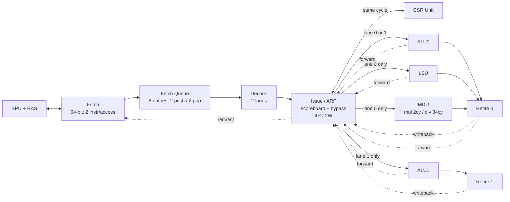

<div align="center">
  <h1>DHRUT-V</h1>
  
</div>

---

A fully pipelined, **2-wide in-order superscalar RISC-V** core (RV32IM_Zicsr)
written in **SystemVerilog**, running on a Sipeed Tang Nano 20K.

Designed for learning, verification, FPGA/ASIC exploration, and as a foundation for future CPU projects.

> **"It will run DOOM one day!"**

---

## Micro-architecture

DHRUT-V is a 2-wide in-order superscalar pipeline, decoupled by SystemVerilog
interfaces. Fetch returns two instructions per access and a queue decouples it
from decode; two decode lanes feed a 2-wide issue stage with four functional
units behind it.

Note what does **not** have a forwarding path below: the MDU. Its result is
several cycles late and reaches consumers only through Retire, which is
precisely why the scoreboard has to hold dependents back.


```mermaid
graph LR
    BPU[BPU + RAS] <--> IF
    IF["Fetch<br/>64-bit: 2 instr/access"] --> FQ["Fetch Queue<br/>8 entries, 2 push / 2 pop"]
    FQ --> ID["Decode<br/>2 lanes"]
    ID --> IS["Issue / ARF<br/>scoreboard + bypass<br/>4R / 2W"]
    IS <-->|same cycle| CSR[CSR Unit]

    IS -->|lane 0 or 1| ALU0[ALU0]
    IS -->|lane 1 only| ALU1[ALU1]
    IS -->|lane 0 only| LSU[LSU]
    IS -->|lane 0 only| MDU["MDU<br/>mul 2cy / div 34cy"]

    ALU0 --> RE0[Retire 0]
    LSU --> RE0
    MDU --> RE0
    ALU1 --> RE1[Retire 1]

    RE0 -.->|writeback| IS
    RE1 -.->|writeback| IS
    ALU0 -.->|forward| IS
    ALU1 -.->|forward| IS
    LSU -.->|forward| IS
    RE0 -.->|forward| IS
    IS -.->|redirect| IF
```

Lane 1 is a bare ALU: it takes OP / OP-IMM / LUI / AUIPC only. Loads, stores,
branches, jumps, CSR ops and multiply/divide all need a unit that exists once,
so they stay on the older lane.

### Pipeline Breakdown

1.  **Fetch (IF)**: One access returns the **two instructions** of an 8-byte
    aligned block. A **BPU** (16-entry BTB, 10-bit tags, 2-bit counters,
    backward-taken/forward-not-taken allocation) and an 8-entry **RAS** predict
    control flow; Issue re-resolves every branch and redirects on a mismatch,
    so no prediction can reach architectural state.
2.  **Fetch Queue**: 8 entries, two push ports and two read ports. Decouples
    fetch from decode, so an imem stall drains the queue instead of starving
    decode immediately.
3.  **Decode (ID)**: Two lanes, each a stateless `decoder` turning one
    instruction into a `uop_t`. Reports back how many slots it consumed.
4.  **Issue (IS)**: The heart of the core.
    - Contains the **Architectural Register File** (4 read, 2 write).
    - **Scoreboard**: per-register outstanding-write counters track pending
      results. Consumers of an outstanding MDU result wait for writeback.
    - **Forwarding**: age-ordered bypass, 4 consumers x 5 producers.
    - **Dual-issue rules** (`issue_hazard.sv`): lane-1 class check plus
      intra-bundle RAW/WAW.
    - Resolves **branches and jumps** early to reduce bubbles.
    - Dispatches CSR ops and traps to the **CSR Unit**, resolved the same cycle.
5.  **Functional Units**:
    - **ALU x2**: one per lane, single cycle.
    - **LSU** (lane 0): loads and stores, sign/zero extension, byte/halfword/word.
    - **MDU** (lane 0): RV32M. Multiply is one 33x33 signed product covering all
      four forms; divide is radix-2 restoring long division, ~34 cycles.
      **Non-blocking** -- a divide does not stall issue, and the scoreboard
      holds back only its true dependents.
6.  **Retire (RE) x2**: One per lane. Lane 0 arbitrates ALU0 / LSU / MDU, with
    the MDU taking priority (ALU0 is held for that cycle); lane 1 takes ALU1.
    Writes back to the ARF and feeds the forwarding network.

---

## Getting Started

### Prerequisites

Ensure you have the following installed (or use the provided install script):

- **Verilator**: For high-performance RTL simulation and linting.
- **RISC-V GNU Toolchain**: `riscv-none-elf-gcc` (xPack distribution recommended).
- **Spike**: The official RISC-V ISA simulator (used as a Golden Reference Model).
- **Python 3.10+**: With `cocotb`, `pyuvm`, and `PyYAML`.

### One-Click Setup

Setup script for Ubuntu/Debian systems:

```bash
# Clone the repo
git clone https://github.com/SudeepSnd/DHRUT-V.git
cd DHRUT-V

# Run the installer (installs toolchain, spike, verilator, and venv)
./tools/install.sh

# FPGA flow only (yosys, nextpnr, gowin_pack, openFPGALoader, SymbiYosys).
# Kept separate: ~1.5 GB, and not needed to run the simulation tests.
./tools/install.sh fpga-tools

# Reload shell to update PATH
source ~/.bashrc
```

### Activate Environment

```bash
source venv/bin/activate
```

---

## Running Simulations

DHRUT-V uses a Python-based verification environment powered by [cocotb](https://www.cocotb.org/) and [pyUVM](https://github.com/pyuvm/pyuvm).

### Run a Specific Assembly Test

Tests are located in `tests/asm/`. To run a test (e.g., `add.S`):

```bash
./tools/simulate.sh add
```

This will:
1. Compile the assembly into an ELF/HEX.
2. Launch Verilator with the `pyUVM` testbench.
3. Compare the RTL execution against a model or expected results.

### RTL Linting

Always keep the RTL clean!

```bash
./tools/lint.sh
```

### Running C Programs / Benchmarks

`tools/simulate_c.sh` is the C-program counterpart to `simulate.sh`: it links
`tests/crt0.S` (minimal bare-metal startup: stack init, `.bss` zeroing, `call
main`, then the usual `tohost` exit) against `tests/linker_c.ld` and one or
more C sources, verifies against Spike, then runs the same Verilator/cocotb
flow.

```bash
./tools/simulate_c.sh <test_name> <c_source1> [c_source2 ...] [-- extra_cflags...]
```

Dhrystone and CoreMark are ported under `tests/bench/` (see each directory's
`NOTICE.md` for provenance and the DHRUT-V-specific porting changes). Since
the core has no UART yet, both benchmarks report through a handful of
`dhrutv_final_*` globals instead of printed text; `tools/bench_report.py`
recovers those values from the DMEM write trace after a run and prints
CPI/IPC and the benchmark score:

```bash
./tools/simulate_c.sh dhrystone tests/bench/dhrystone/dhrystone.c tests/bench/dhrystone/dhrystone_main.c tests/bench/dhrystone/port.c \
    -- -Itests/bench/dhrystone -DITERATIONS=1 -DDHRUTV_RTLSIM=1
./tools/bench_report.py dhrystone --kind dhrystone

./tools/simulate_c.sh coremark tests/bench/coremark/*.c \
    -- -Itests/bench/coremark -DITERATIONS=1 -DCLOCKS_PER_SEC=1 -DFLAGS_STR='"-O2"'
./tools/bench_report.py coremark --kind coremark
```

Note: Verilator+cocotb simulation runs far slower than real hardware
(roughly tens of RTL cycles per wall-clock second), so a full CoreMark run
can take a long time; keep `ITERATIONS` small for iterative development.

---

## Project Structure

```text
DHRUT-V/
├── rtl/                    # SystemVerilog RTL
│   ├── include/            # Packages and shared definitions
│   ├── interfaces/         # SV Interfaces for pipeline connectivity
│   ├── pipeline/           # Core pipeline stages (ifetch, decode, issue, csr, etc.)
│   ├── csr/                # SystemRDL spec + PeakRDL-generated RTL for the CSR block
│   └── tb_top.sv           # Top-level module for simulation
├── test_bench/             # Verification Environment
│   ├── tb_pyuvm/           # pyUVM Agents, Scoreboard, and Environments
│   └── run_test.py         # cocotb entry point
├── tests/                  # Test Suites
│   ├── asm/                # Assembly source files (.S)
│   ├── linker.ld           # Linker script for bare-metal
│   └── build/              # Generated HEX/ELF/DIS artifacts
├── tools/                  # Tooling & Scripts
│   ├── install.sh          # Environment setup ('fpga-tools' for the FPGA flow)
│   ├── lint.sh             # Verilator linting script
│   ├── simulate.sh         # Simulation entry point
│   └── riscof/             # RISCOF configuration and plugins
└── README.md
```

---

## Roadmap

- [x] Full RV32I Base ISA Support.
- [x] Early Branch/Jump resolution.
- [x] Basic pyUVM Verification Infrastructure.
- [x] Full compliance with RV32I_m RISCOF tests.
- [x] **CSR Support (Zicsr), M-mode**: implemented, RDL-generated, directed-test-verified (riscof compliance pending).
- [x] **2-wide superscalar**: dual decode, dual issue, dual retire, age-ordered
      forwarding, per-register scoreboard.
- [x] **Branch prediction**: BTB with 2-bit counters plus a return-address stack.
- [x] **FPGA Deployment**: runs bare-metal code on a **Sipeed Tang Nano 20K**
      (Gowin GW2AR-18). The 32 KB instruction/data-memory UART build uses
      17,054/20,736 LUT4 (82%) and meets 27 MHz with 28.33 MHz routed Fmax;
      programs load into BSRAM over USB UART. See [`fpga/README.md`](fpga/README.md).
- [x] **RV32M (mul/div)**: multiply on a hard DSP, radix-2 divide, non-blocking
      behind the scoreboard. **riscof M compliance 8/8**, and the unit is
      formally verified against a reference model.
- [ ] **Benchmarking and Performance Enhancements**: Dhrystone and CoreMark
      have simulation validation and UART upload support. Dhrystone runs on the
      board; CoreMark hardware validation, steady-state measurements and a
      simulation-to-hardware cycle cross-check remain.
- [ ] **DOOM**: Porting a bare-metal Doom engine.

---

## Creator

**Sudeep Joshi**  
[LinkedIn Profile](https://www.linkedin.com/in/sudeep-joshi-569951207/)

---

## License

This project is licensed under the MIT License - see the [LICENSE](LICENSE) file for details.
